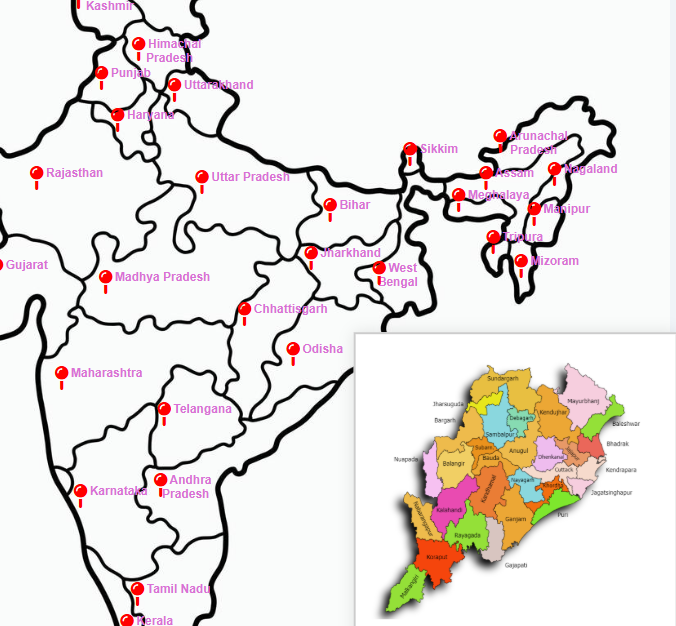

# 🗺️ Interactive India Map with Tooltip Info  

An interactive and responsive **India Map project** built with **HTML & CSS**.  
Each **state and union territory** is marked with a pinpoint 📍, showing a **tooltip with images and facts** when hovered. Clicking a state redirects users to a **detailed external/internal page**.  

🔗 **Live Demo:** [View Hosted Project](https://dharaneesh-s-s.github.io/India-Map/)  

---

## 🌟 Features  

✅ **Clickable pinpoints** for each Indian state & union territory.  
✅ **On-hover tooltip** with:  
   - 📸 Region image  
   - ℹ️ Key facts & stats  
✅ **Responsive layout** 📱 for mobile & web.  
✅ **External/Internal links** supported.  
✅ **Custom Styling** with CSS + Font Awesome icons.  

---

## 🛠️ Technologies Used  

- **HTML5**  
- **CSS3**  
- **Font Awesome (for icons)**  

---

## 📸 Sample Preview  

Here’s how the interactive map looks:  

  

---

## 📂 Project Structure  

